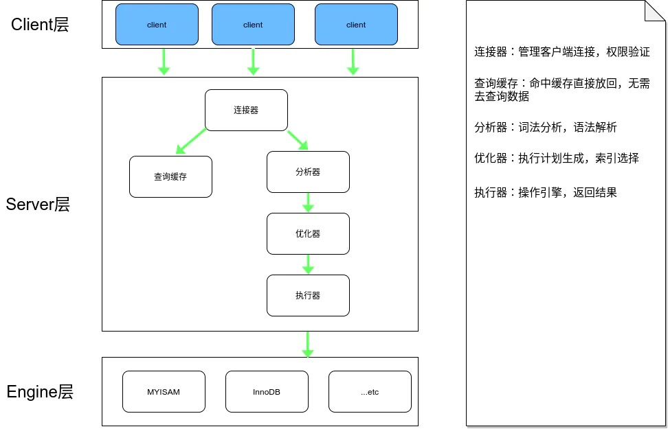
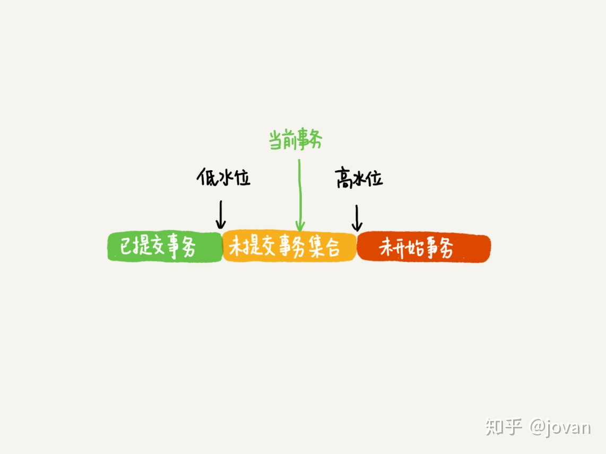
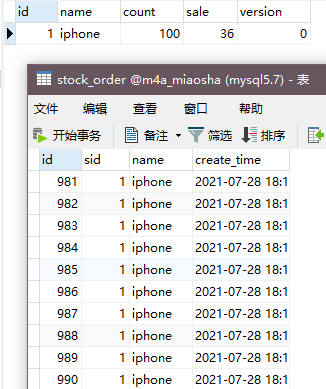

# 秒杀系统中 Redis 与 MySQL 的总结


##  MySQL 服务逻辑架构图





### MySQL的锁机制与多版本并发控制

#### 事务

关系型数据库的ACID我们都是清楚的

原子性(最小的执行单位)、一致性(要不都成功,要不都失败)、隔离性(在修改之前,对其他事务的修改通常是不可见的)、持久性(修改完成之后会永久保存)

隔离级别我们也是清楚的

read uncommitted(未提交读)、read committed(提交读)、repeatable read(可重复读)、serializable(串行化)


| 隔离级别         | 脏读可能性           | 不可重复读可能性                                       | 幻读可能性                 | 加锁读 |
| ---------------- | -------------------- | ------------------------------------------------------ | -------------------------- | ------ |
| read uncommitted | Yes                  | Yes                                                    | Yes                        | No     |
| read committed   | No                   | Yes                                                    | Yes                        | No     |
| repeatable read  | No                   | No                                                     | Yes                        | No     |
| serializable     | No                   | No                                                     | No                         | Yes    |
|                  | 可以读到未提交的数据 | 可以读到已提交的数据,两次读到的不一样,所以叫不可重复读 | 会多读到别人提交的插入数据 |        |


#### 锁

行锁:开销最大,并发最高,在写操作行的情况下,其他线程无法参与,要等到事务完成解锁

表锁:开销最小,并发最差,表同上


#### 多版本并发控制

InnoDB实现了MVCC,也就是多版本并发控制.可以理解为行级锁的一个变种,不同的存储引擎实现的MVCC各不相同,典型的有乐观并发控制和悲观并发控制

乐观锁和悲观锁我们大都有听过,悲观锁觉得别人都会修改数据,所以他不允许其他线程在自己进行同一个写操作,这是标准的行级锁,而乐观锁觉得别人都不会去修改数据,它给数据一个版本号,如果提交的时候版本号相同那么就提交成功,反之则失败.


InnoDB通过在每行记录后面保存两个隐藏的列来实现乐观并发控制,一个保存行的创建时间,一个保存行的过期时间,理解为版本号,开启一个事务版本号就往上加,作为本事务的版本号


数组里面事务ID的最小值记为低水位，当前系统里面已经创建过的事务ID的最大值加1记为高水位。

这个视图数组和高水位，就组成了当前事务的一致性视图（read-view）



假设当前有个正在执行事务99，数据行的历史版本为事务id90（1,1）。

（1）按照事务的开启时间，分别递增分配了100,101,102三个事务ID（trx id）

（2）在SQL语句执行之前，事务A生成一致性视图【99,100】，事务B生成一致性视图【99,100,101】，事务C生成一致性视图【99,100,101,102】

（3）SQL语句的执行之前生成undo log，通过undo log可以生成历史版本数据快照，上图右侧历史版本数据。

（4）事务A的查询执行时，当前数据版本为trx id:101，跟一致性视图【99,100】进行比较，101大于高水位不可见，通过undo log回退到trx id:102版本，102也大于高水位不可见，再回退一个版本到trx id:90，90低于低水位可见，所以事务A读取到的数据为（1.1）。

.jpg)

## 1. 并发情况下直接向MySQL 请求

```java
    @Override
    public int createWrongOrder(int sid) {
        //校验库存  向stock表发送查询请求,如果有售卖数量比库存数量少就返回商品信息
        Stock stock = checkStock(sid);
        //扣库存 向stock表发送update请求,sale数量+1
        saleStock(stock);
        //创建订单 向stockOrder表发送插入请求,创建订单数据
        int id = createOrder(stock);
        return id;
    }
```

在没有开启事务的情况下,我们发起1000个并发,这个时候数据库的情况如下:



那么为什么100个库存没有超卖呢,为什么订单创建了1000个呢?


答案是在做查询操作的时候是没有锁的,而InnoDB引擎的查询操作只查询版本早于事务版本的数据行,所以查询到的数据上,sale的数量可能查询到后它就增加了,而这个时候我们再重新赋值,然后再update,这样就覆盖了原来的数据,可能已经sale 40了又覆盖到5

